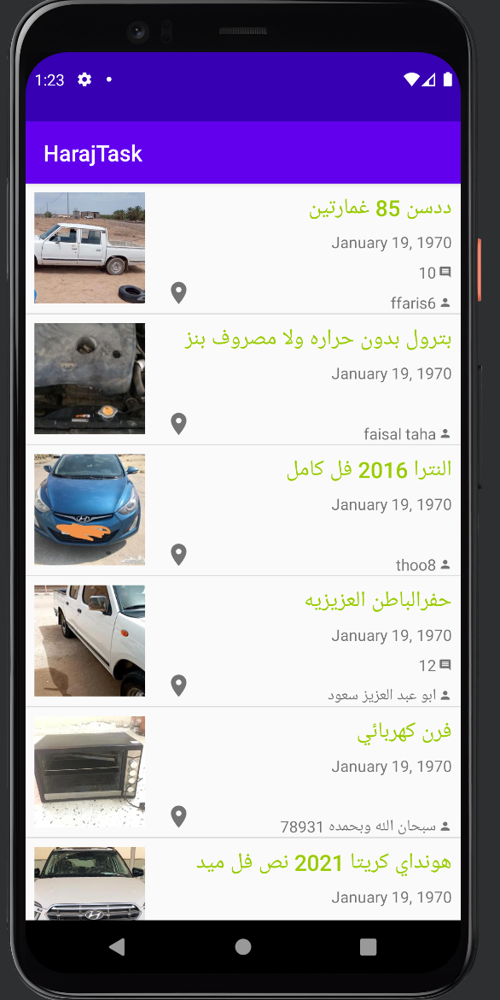
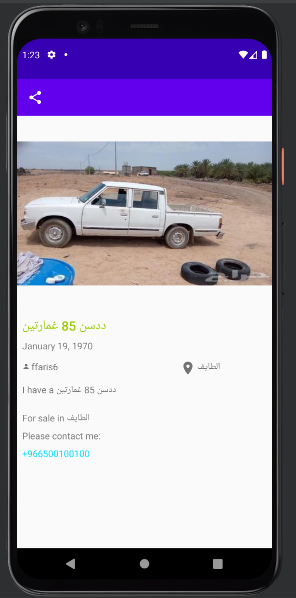

## Haraj Challenge
Welcome to Haraj challenge!

In this repository you will find my implementation of the Haraj challenge

## My Mission

Create a functional app with two screens to display information about Posts from Haraj website.

First, a screen showing a list of Posts from the json file you'll find in `assets` folder.

Second, a screen that displays the information of a particular Post upon click events on the previous screen's list.

The share button should open up Android's native share sheet to share the title of the Post with other apps.

## Stack Used
I made use of MVVM pattern, making use of LiveData, used Glide for loading images from URLs. I also made use of DataBinding
to avoid findViewById calls.

I also went further to make use of [Hilt](https://developer.android.com/training/dependency-injection/hilt-android#hilt-and-dagger) for dependency injection

The MainActivity observes LiveData from the ViewModel and the recyclerview is updated

## Tests written
The test in the instrumentation tests folder tests the repository to ensure that data is returned from the json file

## Evaluation

My work will be evaluated upon the following:
- Following common design patterns (preferably MVVM).
- Clean and testable code.
- Lightweight UI (avoid nested views)

## Submission
Fork this repository and share us the link to your fork after pushing the changes.
